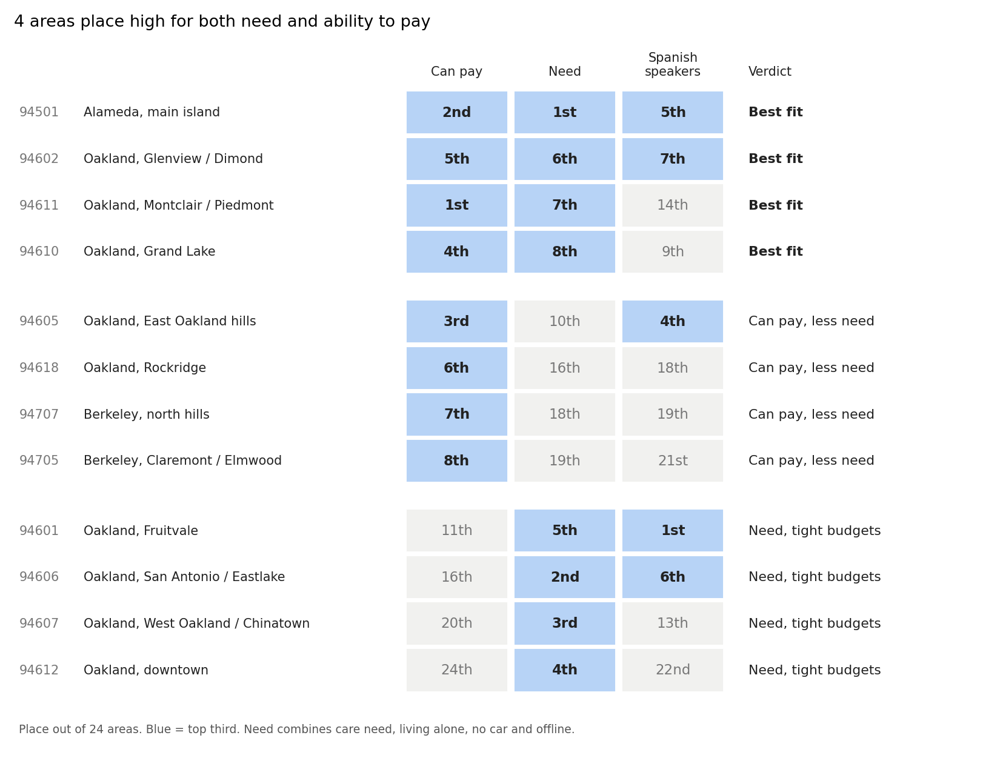
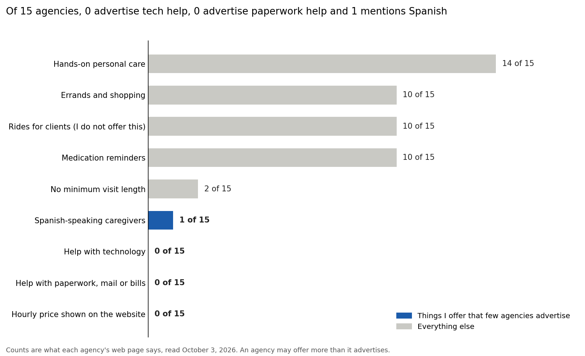
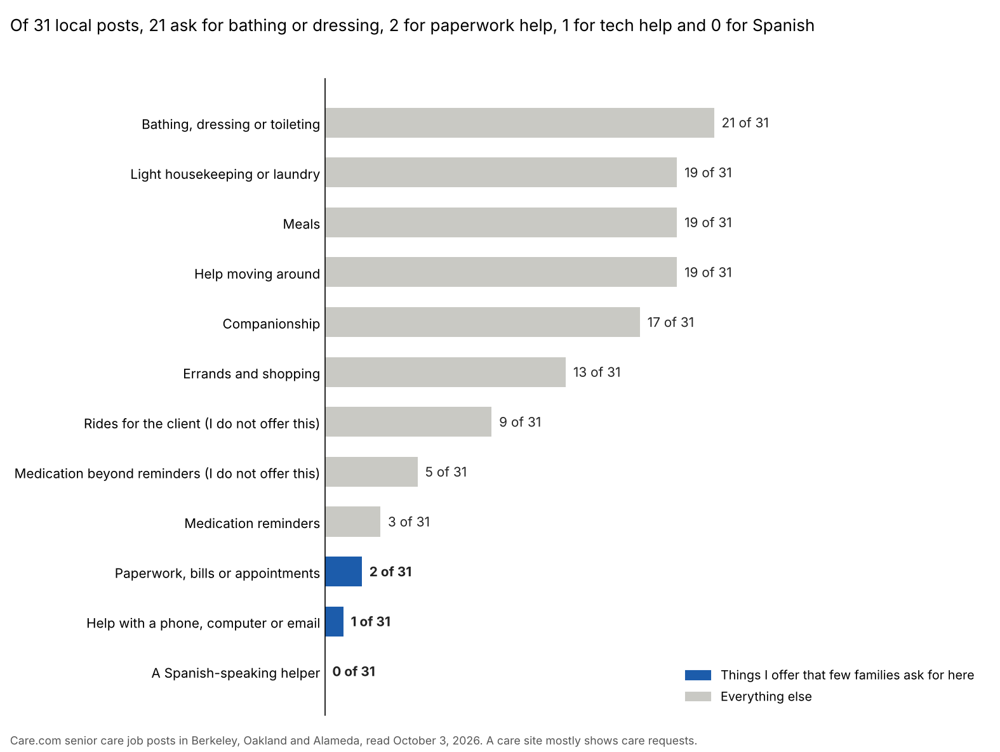
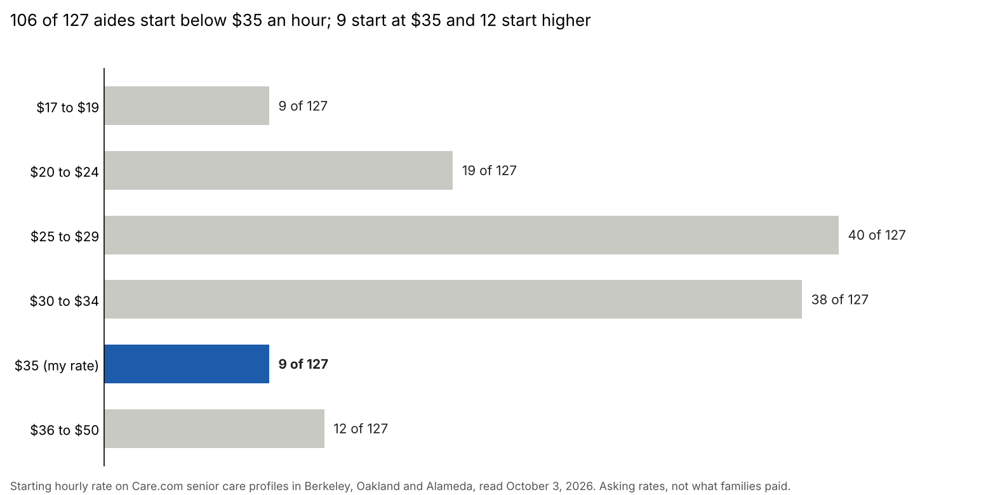
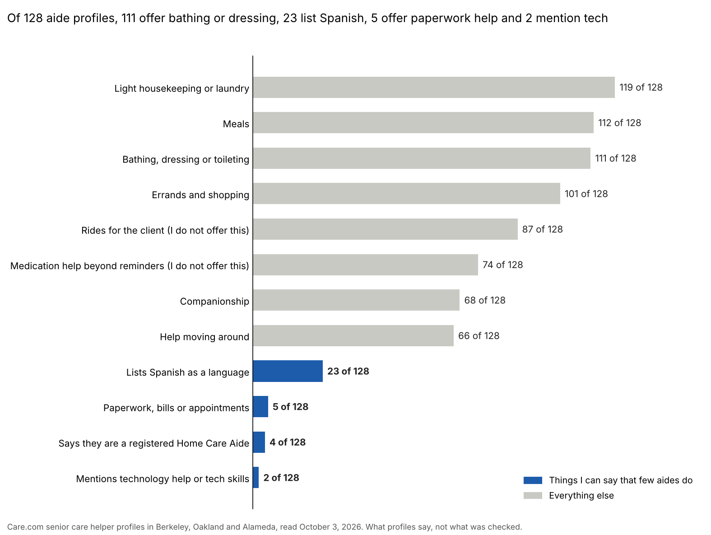

# Bay Area Senior Care Market Analysis

A data project that uses public Census data, a small competitor review, and a reading of public job posts and helper profiles to decide where a one-person home support business in the East Bay should focus, and what it should offer.

The business blends hands-on, nonmedical home care with assistant-type help (errands, paperwork, technology) for older adults in Berkeley, Oakland and Alameda. Each notebook answers one business question in plain language, shows its assumptions, and ends with the decision it led to.

## The answer in one paragraph

Six measures from the question notebooks reduce to two: **need** (care need, living alone, no car and offline all rank areas alike) and **ability to pay**. The two are nearly unrelated across areas (link score 0.18), so the places with the most need are mostly not the places with the most money. Four areas place in the top third on both: **Alameda's main island, Glenview / Dimond, Montclair / Piedmont and Grand Lake**. Alameda's main island comes first under every set of weights tested.

## What I decided

Updated October 4, 2026 (billing by the minute and the 12-hour day changed on October 5, 2026, in the client agreement draft), after reading the family posts, the aide profiles and the wider sites (notebooks 11 and 12 and the notes after them). Three earlier decisions changed: I now drive clients, short visits are allowed close to home, and Spanish is no longer part of my wording.

**Rate and shortest visit depend on the drive each way:**

| Drive each way | Rate | Shortest visit |
| --- | --- | --- |
| Up to 15 minutes | 35 dollars an hour | 2 hours |
| 15 to 30 minutes | 35 dollars an hour | 4 hours |
| 30 to 45 minutes | 40 dollars an hour | 4 hours |

I bill for the actual time I work, from arrival to departure, prorated from the hourly rate to the nearest minute. The shortest visit in the table still applies. I work up to 12 hours in a day and do not take clients more than 45 minutes away. I quote the rate privately. Of the 11 local family posts with a clear visit length, 5 want under 4 hours, so a 4-hour minimum everywhere turned away work close to home. Farther out, the longer minimum and the higher rate make up for the unpaid drive: on a shortest visit at the far edge of each row I earn about 28 to 29 dollars for each hour of my time, drive included.

- **Where to start:** the four best-fit areas above, then the East Oakland hills, a near miss. No change.
- **Schedule:** one or more visits a week.
- **Driving:** I drive clients in my own car, on my regular driver's license and car insurance. 9 of the 31 local family posts ask for rides, 17 of the 35 helper-type posts do, and 87 of 128 aides say they drive clients. This replaces my old no-driving rule.
- **Mileage:** when I drive with a client or for a client, I charge the IRS standard mileage rate in effect that day (76 cents a mile for July to December 2026). My own drive to and from the client's home is free.
- **Medication:** reminders to take it, reminders to refill it, opening containers, and picking up prescriptions. Nothing else: I do not give medication, sort pills, or handle injections or patches. That is my reading of what California's Home Care Services Bureau allows a home care aide to do; it is not legal advice.
- **Paperwork and money:** organize only. That means mail, filing, forms, phone calls, appointments and calendars. No logins, no checks and no paying bills. The five local money and paperwork businesses I found do the bill paying, and none of them does care.
- **Name and wording:** my last name plus "Home Support", with the line "Registered Home Care Aide. Help at home with care, errands, mail and technology." Nobody in the forum questions writes "personal assistant", and one says "Caregiver feels beyond what she needs at the moment." Of 128 aide profiles, 4 say they are registered, 5 offer paperwork help and 2 mention technology.
- **Spanish:** not part of my wording. None of the 31 local family posts asks for it.
- **Where to look for clients first:** Berkeley on Care.com, with local referrals started at the same time. On October 4 I read Care.com's public senior care lists (20 city lists, 234 posts) and sorted the posts into rings by my estimate of drive time from San Pablo Park (ZIP 94702). After cutting live-in posts, nurse-type tasks, one-time jobs and visits shorter than the ring's minimum (2 hours in ring 1, 4 hours in rings 2 and 3), 21 posts are left in ring 1 (about 5 to 15 minutes), 23 in ring 2 (15 to 30) and 65 in ring 3 (30 to 45). Only 6, 2 and 8 of those post a top pay that reaches my rate ($35, $35 and $40). Berkeley has 10 of the ring 1 posts and 5 of the 6 that reach my rate. San Francisco has 31 of the ring 3 posts, but it is the farthest and only 6 reach my rate. Most posters pay less than my rate, so I would be asking for more than they list. Care.com needs an account and a safety screening to apply, which I have not done. Local referrals (Ashby Village members, who exclude Alameda, senior centers, the paperwork businesses that do not do care) have no list of clients and take longest to start. TaskRabbit pays about 35 dollars but is single tasks. All counts are approximate, and Berkeley rests on 10 posts from one day, so treat it as a lead and not a result. Details are in `data/ring_postings.csv`.
- **What makes my service different (idea, October 5):** help at home aimed at keeping people independent, run with simple written routines. For each client that means an intake sheet (their own goals in their words), a short routine for each visit, a half-page visit note shared with the family, one page of instructions from their doctor or therapist followed exactly as written, and a check-in with the client and family every few months about what is working and what the client can now do alone. I support and follow plans from their own professionals. I do not assess, treat, diagnose or promise a medical result, and my wording says "support" and "help with", not "rehab" or "therapy". The Care.com posts show the demand only in pieces: of the 132 posts that fit in rings 1 to 3, 38 ask for mobility help, 26 for staying physically active, 68 for meal preparation and 58 for companionship. Whether a family would pay more for the routine and the check-ins is untested.
- **Areas with high need but tight budgets:** not part of the launch. Income is only part of the picture, so I want to look at assets and savings before deciding about them. No change.

**Still open**

- Make the Care.com account and complete its safety screening before applying to the Berkeley posts, and see whether posters accept my rate.
- Whether to keep the every-other-week visit from notebook 05, now that the rule is one or more visits a week.
- Before the first paid ride, ask my car insurer whether my policy covers driving clients for pay. I could not settle from public pages whether the state's rules for paid passenger carriers apply to an aide.
- Read the Home Care Services Bureau fact sheet on medication myself. I have only seen it quoted.
- Check the drive time from home to Alameda's main island, the top-ranked area, to see which row of the table it falls in.
- Talk to an accountant or a lawyer about working for myself. Questions to bring: with one regular client, am I an independent business or a household employee, and what do the client and I owe (California has a quarterly wage amount that triggers household employer payroll; I did not confirm the figure)? Does California home care licensing apply to one person working alone, and does it matter that I place my own work through Care.com? What wording is safe for exercise, meal and memory activities that follow a professional's plan?
- Ask an insurance broker what general liability, bonding and accident coverage fit a one-person, non-medical business, and get the car insurer's answer in writing.
- Before signing up for Care.com, read its terms myself at https://www.care.com/about/terms-of-use/. A second reading says the terms ban using its messages to market a business, that disputes go to private arbitration with an opt-out only by mailed letter within 30 days of first use, and that screening covers arrests and charges, including people in my household. I have not verified those points. Care.com's own guidance to families says most senior caregivers are employees.
- Have a lawyer review the client agreement draft in `docs/client_service_agreement_draft.md` (written October 5). It sets a late-cancellation charge of the shortest-visit time at the client's hourly rate, 30 days' notice to end, weekly invoices due in 7 days, no late fees, and check-ins every 3 months. Its drafting notes list the questions to bring, and the name, contact and per-client blanks are still placeholders. If the first client comes through a platform or agency, ask first whether it sets my pay or terms, since that can decide whether I am a contractor.
- Email the referral agencies in `data/referral_channels.csv` and ask what they pay or let me charge, what they charge families, and whether aides are contractors or employees. Their public pages do not say.
- Research referral sources (geriatric care managers, hospital and rehab discharge planners, senior centers, physical therapists) the same way. Not started.

Notebooks 05, 06, 07, 10, 11 and 12 were written under my old rules (35 dollars, a 4-hour minimum everywhere, no driving, Spanish in all my materials). Their numbers still stand. Their "What I decided" endings, the count of posts that "fit my rules", and the chart labels that say "I do not offer this" use the old rules.

## Results by notebook

**Notebook 01: where are the clients?**
- The five ZIP codes with the largest estimated pool of 65+ households that can likely pay and may need help: 94501 (Alameda), then 94610, 94602, 94605 and 94611 (Oakland).
- The top five do not change when the income floor is set to 50,000, 75,000 or 100,000 dollars a year.

**Notebook 02: hands-on care or assistant-type help?**
- The two needs partly overlap across the 24 areas (overlap score 0.56 on a scale of -1 to 1).
- The same five ZIP codes rank high for both, so a blended message fits there.
- Care-leaning areas: 94601 (Fruitvale), 94703 (central and south Berkeley), 94606 (San Antonio / Eastlake).
- Assistant-leaning areas: 94618 (Rockridge), 94707 and 94708 (Berkeley hills).

**Notebook 03: where do the oldest residents live?**
- Ranking areas by people 75+ gives almost the same order as ranking by people 65+ (overlap score 0.98), so age adds little to the picture.
- People 85+ are more concentrated: Alameda's main island has 1,908, nearly twice the next area. About 713 older adults there live in nursing homes, which explains part of that.
- Downtown Oakland ranks 15th for people 65+ but 7th for people 85+.

**Notebook 04: who lives alone, and can they pay?**
- About 29,000 people 65+ live alone in these areas (29% of older adults living at home). About 64% are women.
- A person living alone typically has about 59% of the income of the typical older household, so "can pay" judged by household income overstates what they can afford.
- A weekly visit costs 7,280 dollars a year. By my income lines, it is comfortable in 10 areas (31% of people living alone), a stretch in 6 (34%) and out of reach on income alone in 8 (35%).
- Alameda's main island has the most people living alone (2,860), but their typical income is about 38,000 dollars, which makes a weekly visit a stretch.

**Notebook 05: how many hours can a typical client afford?**
- Assuming a household can spend up to 12% of its income on help, at 35 dollars an hour: about 56% of older households can afford one 4-hour visit a week, 73% can afford one every other week, and 33% can afford two a week.
- Each 5 dollars added to the hourly rate removes about 4 percentage points of households (61% at 30 dollars, 48% at 45 dollars).
- A 4-hour visit every other week reaches the same households as a 2-hour weekly minimum would, without shortening the visit.
- The typical older household can afford the 4-hour weekly visit in 16 of 24 areas; the typical person living alone can in 9.

**Notebook 06: where would speaking Spanish be an advantage?**
- About 9,000 people 65+ speak Spanish at home (9% of older adults), and 47% of them speak English less than very well.
- They are concentrated: Fruitvale, Elmhurst and the Coliseum area hold 42% of them. Fruitvale alone has 2,115, about a third of its older adults.
- Those three areas have low typical incomes. The areas with 300 or more older Spanish speakers and incomes that fit a weekly visit are the East Oakland hills, Alameda's main island, Glenview / Dimond, Grand Lake and Laurel / Redwood Heights.
- For comparison, about 17,700 people 65+ speak an Asian or Pacific Island language at home, and 78% of them speak limited English.

**Notebook 07: where do older adults lack a car?**
- About 13,500 older households have no car, 21% of older households.
- Going without a car tracks income closely (link score -0.82): 55% of car-free older households are in areas where the typical income is below the line for a weekly visit. Downtown Oakland stands out, with 70% of older households car-free.
- In the 16 areas where a weekly visit fits the typical income, 14% of older households have no car, about 1 in 7. The largest groups are on Alameda's main island (1,036) and in Montclair / Piedmont (983), Grand Lake (686) and Glenview / Dimond (601).

**Notebook 08: where is the tech gap largest?**
- About 12,300 people 65+ are offline at home (no device, or a device with no internet): 12% of older adults. The other 88% have a device and broadband.
- Being offline tracks income closely (link score -0.83): 52% of offline older adults are in areas where the typical income is below the line for a weekly visit.
- In the 16 areas where a weekly visit fits the typical income, 9% are offline and 91% are connected. There, tech help mostly means helping people use devices they already own, which the Census does not measure.

**Notebook 09: the scorecard**
- Best fit (high need and can pay): Alameda's main island, Glenview / Dimond, Montclair / Piedmont, Grand Lake.
- Can pay, less need: East Oakland hills (a near miss for "best fit", and 4th for Spanish speakers), Rockridge, Berkeley north hills, Claremont / Elmwood.
- Need, tight budgets: Fruitvale (1st for Spanish speakers), San Antonio / Eastlake, West Oakland / Chinatown, downtown Oakland.
- Weights test: only Alameda's main island and Glenview / Dimond stay in the top five under all four sets of weights. The order below first place depends on how much ability to pay counts against need.

**Notebook 10: who would a family hire instead of me?**
- This one is not Census data. I read one public web page for each of 15 home care agencies serving Alameda or Oakland, and two Care.com listing pages, on October 3, 2026.
- Of the 15 agencies, 14 advertise hands-on care, 10 errands, 10 rides for clients and 10 medication reminders.
- None advertise help with technology or with paperwork, mail and bills. One mentions Spanish-speaking caregivers. None show an hourly price, and two say they have no minimum visit.
- Among the first 20 Care.com helper profiles in each of two listings, none mention tech help or Spanish, and 3 to 4 mention paperwork or admin help. Their posted rates average 28 to 33 dollars an hour. That came from the short listing text only. Notebook 12 read the full profiles and found that some do list Spanish.

**Notebook 11: what do families ask for?**
- This one is not Census data either. On October 3, 2026 I read 121 public job posts written by families: every senior care post Care.com showed for Berkeley, Oakland and Alameda (97 different posts, 31 of them in those three cities), 16 household or assistant posts, and 8 undated posts from eldercare.com.
- Of the 31 local posts, 21 ask for bathing or dressing, 19 each for meals, housekeeping and help moving around, 17 for companionship and 13 for errands. 9 ask for rides and 5 want medication help beyond reminders.
- 2 ask for paperwork help, 1 for technology help and none for Spanish. A care site mostly shows care requests, so this does not measure how many families want those services.
- The typical pay range is 20 to 30 dollars an hour. The top of the range is below 35 dollars in 22 of the 31 posts.
- Only 4 of the 31 local posts pass all the rules I had at the time (part-time, no rides, reminders only, not clearly under 4 hours) and reach 35 dollars. I have not recounted under the new rules.

**Notebook 12: what do other aides offer?**
- Also not Census data. On October 3, 2026 I read every helper profile Care.com showed for Berkeley, Oakland and Alameda: 128 senior care profiles and 11 assistant profiles. No names or profile links are kept.
- The middle aide starts at 28 dollars an hour, and half start between 25 and 30. Of the 127 that show a usable rate, 106 start below my 35 dollars, 9 start at 35 and 12 start higher.
- Most offer the same list: housekeeping (119 of 128), meals (112), bathing or dressing (111) and errands (101). 87 say they drive clients and 74 tick medication help, the two things I did not offer at the time.
- 23 list Spanish, 5 offer paperwork help, 4 say they are a registered Home Care Aide, 2 mention technology and 2 state a minimum visit or shift length. Nobody offers hands-on care, paperwork or tech help, and Spanish together.
- Aides who start at 35 dollars or more show more years of experience (10 against 6) and are more likely to have a review (11 of 21 against 34 of 106).

**After notebook 12: where are assistant-type skills needed? (notes only, no notebook yet)**
- On October 4, 2026 I looked beyond care sites: a local advice forum, job sites, a trade directory and a gig site. The notes are in `data/community_postings.csv`, `data/work_names.csv`, `data/money_managers.csv` and `data/local_programs.csv`.
- Berkeley Parents Network forum, 15 recent questions about help for an elder: 1 asks for my whole blend ("Caregiver feels beyond what she needs at the moment."), 4 are helper-type with no hands-on care, and of the 10 that state a schedule, 5 want three visits a week or fewer. 8 want an individual and 4 an agency. Nobody writes "personal assistant".
- Job sites: these skills are asked for most by busy families ("family assistant", "house manager", 33 to 55 dollars an hour, usually with childcare and driving) and by executives. None of the 39 family assistant, household assistant and EstateJobs listings I read mentions an older adult.
- Daily money managers: the trade directory lists 70 in California, 11 in the East Bay and 5 in my three cities, against 128 senior care aides on Care.com. None of the 5 posts a price, and none offers care.
- TaskRabbit: about 35 dollars an hour for personal assistant tasks in Berkeley and 32 for errands in Oakland. Tasks are booked one at a time and the pages do not mention older adults.
- Splitting the Care.com family posts from notebook 11: 35 of 97 are helper-type (no bathing or dressing, no help moving around, no medication beyond reminders). They post about the same pay as hands-on care, about half ask for driving (17 of 35), and they lean toward 1 or 2 days a week (12 of the 29 that say).
- Ashby Village volunteers help members with technology, rides and groceries for free, but cannot do hands-on care, and a volunteer companion is for a one-time need.

Every number here is an estimate for ranking areas, not a count of clients; see Limits.

## What's here

| Path | What it is |
| --- | --- |
| `notebooks/00_get_data.ipynb` | Downloads every Census measure the project uses and saves one table by ZIP code |
| `data/census_by_zip.csv` | That table: 24 ZIP code areas, 43 measures. `data_dictionary.csv` explains each column |
| `notebooks/01_where_are_the_clients.ipynb` | Which ZIP codes have the most likely clients, and whether that holds at different income floors |
| `notebooks/02_care_vs_assistant.ipynb` | Whether hands-on care need and assistant-type demand sit in the same areas |
| `notebooks/03_oldest_residents.ipynb` | Where people 75+ and 85+ live, and whether age changes the ranking |
| `notebooks/04_living_alone.ipynb` | Where older adults live alone, and whether a typical income there covers a weekly visit |
| `notebooks/05_affordable_hours.ipynb` | How many older households can afford each rate, visit length and schedule |
| `notebooks/06_spanish_speakers.ipynb` | Where older Spanish speakers live, how many speak limited English, and whether incomes there fit my rate |
| `notebooks/07_no_car.ipynb` | Where older households have no car, and what that means for errands and the no-driving rule I had then |
| `notebooks/08_tech_gap.ipynb` | Where older adults have no computer or internet at home, and what kind of tech help fits where |
| `notebooks/09_scorecard.ipynb` | All the measures side by side, a verdict for each area, and a test of the weights |
| `notebooks/10_competitors.ipynb` | What 15 local agencies and Care.com helpers advertise, and what I offer that they do not |
| `notebooks/11_what_families_ask_for.ipynb` | What families ask for in their job posts, what they offer to pay, and how many posts fit the rules I had then |
| `notebooks/12_what_aides_offer.ipynb` | What other independent aides offer and charge, where my rate lands, and what I can say that they do not |
| `data/competitors.csv`, `data/care_com_listings.csv` | Hand-recorded notes from competitor web pages, with the address of each page |
| `data/family_postings.csv`, `data/family_postings_sources.csv` | One row per family job post (no names), and how many posts each listing had and how many were read |
| `data/ring_postings.csv`, `data/ring_postings_sources.csv`, `data/ring_postings_dictionary.csv` | One row per Care.com senior care post from 20 East Bay, San Francisco and nearby city lists on October 4 (234 posts, no names, job IDs or text), placed in a distance ring from San Pablo Park by ZIP, with the tasks, pay, schedule and cut flags, and how many pages each list had and how many were read. The dictionary file explains each column. No notebook uses these yet |
| `data/referral_channels.csv` | One row per place an independent aide could find clients (a county registry, private referral agencies, care marketplaces, Care.com), with what each public page says about who sets pay, fees, employment status and requirements, "not stated" where it does not say, and the page address. Checked October 4 and 5. No notebook uses it yet |
| `data/aide_postings.csv`, `data/aide_postings_sources.csv` | One row per helper profile (no names or profile links), and how many profiles each listing had and how many were read |
| `data/community_postings.csv`, `data/community_postings_sources.csv` | One row per question families posted on a local advice forum (Berkeley Parents Network), with no names, and how many were read. No notebook uses these yet |
| `data/work_names.csv` | What the same skills are called on job and gig sites (family assistant, personal assistant, administrative assistant, daily money manager), with pay, requirements and the page address |
| `data/money_managers.csv`, `data/money_managers_sources.csv` | Daily money managers listed for the East Bay in the trade directory (business names only), and the counts |
| `data/local_programs.csv` | Local programs that touch the same needs (Ashby Village, the county directory for older adults) |
| `docs/client_service_agreement_draft.md` | Draft client agreement (October 5, 2026), with name, contact and per-client blanks left as placeholders and drafting notes for a lawyer. The editable version is a Claude Docs document; this is a copy |
| `docs/questions_for_professionals.md` | Questions to bring to an accountant, a lawyer and an insurer (a broker and my car insurer), each with a line on why I am asking. The editable version is a Claude Docs document; this is a copy |
| `outputs/` | The charts and ranked tables the notebooks save |
| `requirements.txt` | Python packages needed |

## How to run (Windows, Anaconda)

1. Get a free Census API key (required): https://api.census.gov/data/key_signup.html. It arrives by email; click the activation link in that email.
2. In this project folder, create a text file named `census_key.txt` and paste the key into it. The file is listed in `.gitignore`, so it never goes to GitHub.
3. Open **Anaconda Prompt**, go to this folder, and install the packages: `pip install -r requirements.txt`
4. Start Jupyter with `jupyter notebook` and run `notebooks/00_get_data.ipynb` first. It builds the shared table in `data/`.
5. Run the other notebooks in order. Notebooks 03 to 09 read the shared table and need no key. Notebooks 01 and 02 download their own data, notebook 10 reads the competitor files in `data/`, and notebooks 11 and 12 read the postings files in `data/`.

## Data

U.S. Census Bureau, American Community Survey 5-year estimates (2020-2024), by ZIP code tabulation area. Tables used: B01001 (age), B09020 (living arrangements, 65+), B16004 (language and English ability), B18106 (self-care difficulty), B18107 (independent living difficulty), B19037 and B19049 (household income by age of householder), B19215 (income of people living alone), B25007 (owning or renting), B25045 (vehicles), B28005 (computer and internet). `data/variable_labels.csv` lists every Census variable behind each column. Public and free.

## Limits

- ZIP areas do not match city borders exactly.
- Survey estimates are less reliable for small ZIP codes, so treat close rankings as ties.
- The income lines that count as "can afford help" are assumptions, set at the top of each notebook.
- The Census publishes each measure separately. It does not say how many people are, for example, both living alone and able to pay.
- The competitor review covers 15 agencies and one web page each. It records what they advertise, which may differ from what they offer.
- The family job posts are nearly all from one site on one day. They show what families ask for when they are shopping for a caregiver, not how many families want other kinds of help.
- The helper profiles are also from one site on one day. They show what aides say they offer and what they ask to be paid, not what they do or earn.
- The referral agency and marketplace notes come from each business's homepage or one or two pages, read once. Most do not publish pay or fees for aides, CareLinx's fees come from review sites, and Thumbtack was not read.
- The ring posts are from one site on one day. The rings are my own estimates of off-peak drive time by ZIP, not a routing lookup. The medication, hospice, paperwork, technology and Spanish columns are keyword matches, so they are approximate, and "fit" does not yet include the short-visit rule.
- The October 4 notes on job sites, the money manager directory and the gig site come from the first page of each listing, read once. Treat them as examples, not counts of a market.
- This shows where people live, not who wants to hire. Local conversations still decide that.

## Privacy

This repo uses public data only. Do not add client names, intake forms, logs, or API keys.
